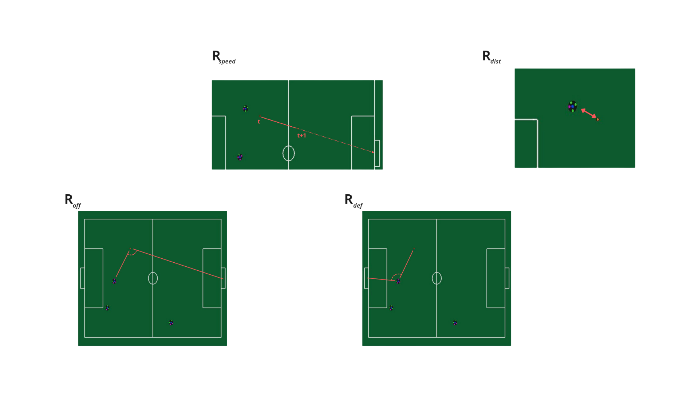

Este repostório utiliza a biblioteca [rsoccer](https://github.com/robocin/rSoccer) para aplicar algortimos de Reinforcement Learning (RL) no ambinete Small Size League - EntryLevel (SSL). 

# Informações do ambiente
A implementação feita usa o conceito de self-play para que robôs aprendam a jogar, inspirado no trabalho [*Multiagent Reinforcement Learning for Strategic Decision Making and Control in Robotic Soccer Through Self-Play*](https://ieeexplore.ieee.org/document/9817118) no ambiente Very Small Size Soccer (VSSS).  O ambiente foi contruído pensando em um jogo 3x3.

## Episódio
Um episódio é finalizado assim que um gol é marcado ou atinja um tempo limite. Caso a bola sai de campo, os jogadores e a bola são colocados nas suas posições iniciais e jogo continua.

  

## Espaço de ações
Um robô pode possui 4 ações continuas: alterar velocidade no eixo x, alterar velocidade no eixo y, alterar velocidade ângular, chutar a bola.

  

## Espaço de observações
Um robô a cada iteração com o ambiente, uma observação é contruída a partir das coordenadas dos robôs aliados, adversários e da bola. As features que compõe a observação são construídas manualmente, são elas:

**1. Posições:**
* Robôs aliados
* Robôs adversários
* Bola.

**2. Distâncias:**

* Bola para o robô
* Bola para gol aliado, 
* Bola para gol adversário

**3. Orientações (seno, cosseno e ângulo):** 
* Robôs aliados
* Robôs adversários

**4. Ângulo das retas em relação a horizontal (seno, cosseno e ângulo):**
* Do robô para os aliados
* Do robô para os adversários
* Do robô para a bola

**5. tempo restante da partida**

Ao todo, cada robô tem como obsevação concatenção de todas essa features, o que gera um vetor de 77 valores. Além disso, os últimos 7 vetores observação são concatenados com a atual, totalizando 8 x 77 = 616 valores de input para rede da política. Todos os valores são normalizadas para estarem entre 0 e 1.

## Recompensa
Para guiar o aprendizado dos agentes há as recompensas contínuas, que dâo feedback a cada step no ambiente, e as esparsas, aquelas que acontecem apenas em algumas situações. As recompensas contínuas são calculadas com base em quatro aspectos, duas delas sendo compartilhadas pelo time e as outras duas individuais. Os compartilhados são velocidade da bola (r_speed) e a distancia até a bola do robô aliado mais próximo (r_dist). As individuais medem o quão ofensiva e defensiva a posição do robô é no momento, a ofensiva (r_off) é o ângulo entre o robô, a bola e o gol do adversário, a defensiva (r_def) é o ângulo entre o gol aliado, o robô e a bola. Essas quatro recompensas são combinadas linearmente, de tal forma que a recompensa total a cada step fique entre -1 e 1. No fim, a equação da recompensa total é:

$$R_{total} = 0.7R_{speed} + 0.1R_{dist} + 0.1R_{off} + 0.1R_{def}$$

  

Em relação as recompensas esparsas há um total de 2, a primeira delas está relacionada ao gol marcado e a segunda quando a bola saí de campo:

$$GOAL_{REWARD} = 10$$

$$OUTSIDE_{REWARD} = -10$$

# Preparando o container

**Clone o reposítorio com o comando:**

    git clone https://<seu-username>:<seu-token>@github.com/Pequi-Mecanico-SSL/RL.git

*Obs: Caso nào tenha, gere o seu token em: *Settings > Developer settings > Personal access tokens*.

**Construa a imagem:**

    docker build -t ssl-el .

**Rode o container**

O commando a abaixo irá criar três volumes. O primeiro para salvar os checkpoints do treinamento. O segundo para salvar videos gravados do ambiente durante o treinamento. Por fim, o terceiro é apenas para usar o display para renderizar o ambiente do container.

    docker run --gpus all --name pequi-ssl \
        -e DISPLAY=$DISPLAY \
        -v /tmp/.X11-unix:/tmp/.X11-unix \
        -v $(pwd)/videos:/ws/videos \
        -v $(pwd)/dgx_checkpoints/PPO_selfplay_rec:/root/ray_results/PPO_selfplay_rec \
        -it ssl-el

**Para conseguir renderizar um episódio** 

Em outro terminal fora do container rode:

    xhost +local:root
    
# Dentro do container
Uma vez dentro do container é possível treinar os agentes no ambiente usando o rllib ou analisar um checkpoint já treinado rederizando o ambiente.

## 1. Para realizar um treinamento com rllib
Vá no arquivo `config.yaml`  e mude as configurações que achar necessário, nele é possível alterar configurações do PPO, do ambiente, da rede neural, treinamento e validação. Os valores padrões já devem conseguir apreder algo.

Após isso, rode o comando abaixo para treinar salvando alguns episódios com mp4 durante a treinamento. 

    python rllib_multiagent.py --evaluation

Caso queira apenas treinar, sem salvar nenhum video, basta tirar a `flag --evaluation`

Acompanhe as métricas do treino em tempo real com tensorboard, vá em um terminal fora do container dentro do projeto e rode:

    tensorboard --logdir=dgx_checkpoints

## 2. Para analisar um checkpoint treinado
Olhe a pasta dgx_checkpoints (volume) fora do container, se você já realizou algo treinamento seguindo o passo 1, seu checkpoint deve estar lá. O nome da pasta de um checkpoint é parecido com algo como:

    dgx_checkpoints/PPO_selfplay_rec/PPO_Soccer_95caf_00000_0_2024-11-21_02-23-24/checkpoint_000001

é importante apenas saber:

* **Nome do exemperiemento:** PPO_Soccer_95caf_00000_0_2024-11-21_02-23-24
* **Número do checkpoint:** checkpoint_000001

Com isso anotado, abra o arquivo `render_episode.py` e altera a variável global CHECKPOINT_PATH, substuindo o nome do experiemento e número do checkpoint, o restante do caminho deve permanecer o mesmo. A estrutura deve ser: 

    /root/ray_results/PPO_selfplay_rec/NOME_DO_EXPERIEMENTO/NUMERO_DO_CHECKPOINT

Por exemplo, o CHECKPOINT_PATH para o exemplo acima ficaria:

    /root/ray_results/PPO_selfplay_rec/PPO_Soccer_95caf_00000_0_2024-11-21_02-23-24/checkpoint_000001

Com tudo configurado, agora rode o `render_episode.py`
    python render_episode.py
    
Caso não esteja reconhecendo a gpu, tente instalar o [nvidia container toolkit](https://docs.nvidia.com/datacenter/cloud-native/container-toolkit/latest/install-guide.html#installing-with-apt) ou mudar a versão do cuda no dockerfile
